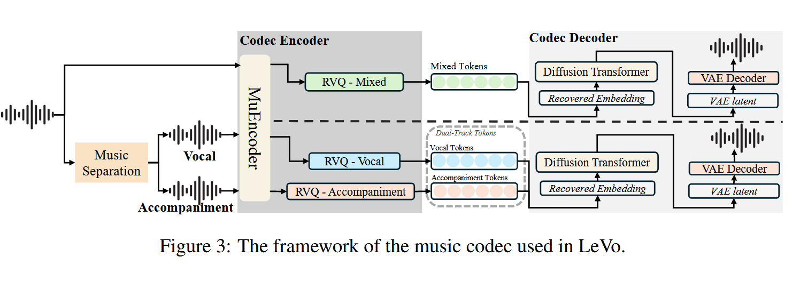
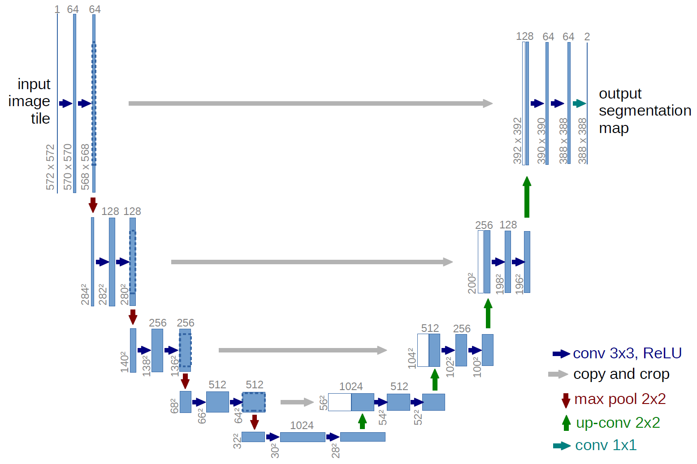

## 8.5
### 1.阅读综述论文 
#### 1.音乐要素
#### 2.常见数据表示：
MIDI：符号化表示，适合捕捉音乐结构和多轨生成。
频谱图：图像化表示，适用于音频生成任务。
原始波形：直接处理音频信号，保留完整信息但缺乏结构。
#### 3. **音乐生成任务分类**
   - **表演生成**：单乐器、多乐器或多轨音乐生成。
   - **乐谱生成**：生成可演奏的乐谱（如钢琴卷帘）。
   - **音频生成**：直接生成可播放的音频（如原始波形或频谱图）。
   - **歌曲延续**：基于现有片段生成后续音乐。

#### 4. **评估方法**
   - **主观指标**：人类听众对生成音乐的质量、真实性和创造性的评分。
   - **客观指标**：
     - 图像生成指标（如Inception Score、Fréchet Inception Distance）。
     - 音乐特定指标（如长音符比例、音高范围等）。
   - 当前评估体系并不标准

#### 5. **生成模型架构**
   - **生成对抗网络（GANs）**：
     - 适用于MIDI（如MuseGAN）、频谱图（如SpecGAN）和原始波形（如WaveGAN）。
     - 优势：生成多样性高；劣势：训练不稳定。
   - **循环神经网络（RNNs/LSTMs）**：
     - 擅长序列建模（如A-Muze-Net），适合MIDI和原始波形。
   - **变分自编码器（VAEs）**：
     - 通过潜在空间控制生成（如调整音调张力）。
   - **扩散模型**：
     - 新兴方法，在高质量音乐生成中表现优异（如MusicGen、Noise2Music）。
   - **Transformer模型**：
     - 处理长序列依赖（如MusicLM），支持文本到音乐的生成。

#### 6. **关键模型与性能**
   - **最佳模型**：
     - **MIDI数据**：MidiPGAN（GAN）、A-Muze-Net（RNN）。
     - **频谱图**：MP3Net（GAN）、Mousai（扩散模型）。
     - **原始波形**：Self-Attention GAN、Noise2Music（扩散模型）。
   - **综合性能**：
     - **RE-RL Tuner**（强化学习结合LSTM）和**MusicGen**（Transformer）在用户评分和音乐质量上表现最佳。

#### 7. **挑战与未来方向**
   - **挑战**：
     - 生成音乐缺乏人类情感和创新性。
     - 长序列生成的全局一致性不足。
   - **未来方向**：
     - 结合多种数据表示（如MIDI与原始波形）。
     - 探索扩散模型和Transformer的潜力。
     - 开发标准化评估指标。
     - 强化学习与音乐理论的结合。

#### 8. **结论**
   - GANs和Transformer是目前最有效的架构，MIDI是最佳输入表示。
   - 未来需进一步优化模型以生成更具创造性和情感的音乐，并推动评估标准化。

### 2.体验AI音乐产品
给相同提示词：R＆B风格 方大同音色 节奏与律动 蓝色 风格清澈
R＆B song with fresh vibe and blue color and rythmic melody by male singer with drums

#### 海绵音乐：伴奏质量中，人声质量中
#### 网易云音：歌曲结构完整，伴奏质量低，人声质量低，机械
#### TME：主要是歌曲识别，扒谱效果不错；生成伴奏质量中
#### suno：伴奏质量高，人声质量高，结构完整
#### udio：伴奏质量高，人声质量高

#### ⭐suno > udio > others

### 3.个人总结

当前体验到市面上最好AI音乐产品已基本能够生成“可听”的音乐
不过仍存在一些问题：
1. 人声不够真实，音色像合成器
2. 伴奏整体较为扁平，前后变化少

TME的歌曲扒谱效果还挺不错，生成速度快，质量高；这项任务对于一般的音乐人/乐手还是有些门槛或者较为繁琐。

## 8.6
### 1.2025以来较新的Song_generator demo
#### LeVo https://levo-demo.github.io/
#### SongGen https://liuzh-19.github.io/SongGen/
#### Diffrhythm+ https://longwaytog0.github.io/DiffRhythmPlus/#Musical-Skills
#### SongComposer https://pjlab-songcomposer.github.io/

#### SongCreator https://thuhcsi.github.io/SongCreator/

结论：表现最好的应该是LeVo（尚未开源），效果和suno（未开源）类似，强于市面上产品
优缺点和之前市面产品差不多

## 8.8

# 薛俊智Teleai实习计划
## **一、实习目标**
1. **产品认知培养**：通过体验主流AI音乐产品（如Suno、Udio等），建立对音乐生成技术商业化落地的认知框架。  
2. **技术能力提升**：深入理解AI音乐生成领域的前沿技术（Transformer、扩散模型等），并实践应用。  
3. **实践项目参与**：独立探索音乐生成技术的基础模型，尝试复现较新的开源模型（如Diffrhythm+, SongGen等）。   

## **二、具体计划**
### **第一周：产品体验与技术调研**
- **AI音乐产品评测**（Suno、Udio、网易云音乐AI等）  
  - 记录生成质量（人声、伴奏、结构）  
  - 对比不同产品的优劣势  
- **阅读1-2篇综述论文**  
  - 了解当前AI音乐生成的技术路线（GANs、Transformers、扩散模型）  
  - 整理关键模型（如MusicLM、Jukebox、Riffusion）  

### **第二周：模型复现与实验**
- **选择1个开源模型（如Diffrhythm+, SongGen）**  
- **搭建环境，跑通Demo**  
  - 尝试生成不同风格的音乐片段  
  - 调整参数观察效果变化  
- **记录实验过程（代码、生成样本、问题总结）**  

### **第三-四周：独立探索与优化**
- **基于开源模型进行微调**（如调整提示词、优化生成参数）  
- **尝试组合不同技术**（如Diffusion + Transformer）  
- **整理技术文档**（模型原理、实验步骤、优化思路）  

### **第四周：总结与报告**
- **撰写实习报告**（包含产品分析、技术实验、个人总结）  
- **整理可展示的成果**（生成音乐样本、代码仓库、文献笔记）  
- **向导师汇报**（PPT或文档形式）  

## **三、预期成果**
1. **AI音乐产品评测报告**（对比表格+个人体验总结）  
2. **开源模型实验记录**（代码+生成样本+问题总结）  
3. **最终实习报告**（技术收获、产品认知、个人成长）  

## 8.11
选择效果较好的LeVo模型尝试复现
https://github.com/tencent-ailab/songgeneration/

配置zotero环境
阅读论文
`LeVo: High-Quality Song Generation with Multi-Preference Alignment`

### LeVo 框架完整流程总结

LeVo 框架旨在通过一个统一的语言模型，实现高质量的歌曲生成。整个流程可以分为以下三个核心阶段：

1.  **输入处理与令牌化**：
    * **目的**：将不同类型的输入（歌词、文本提示、音频提示）转换成模型可以处理的、统一格式的令牌序列。
    * **具体步骤**：
        * 歌词和文本提示通过 `BPE Tokenizer` 转化为文本令牌。
        * 音频提示通过 `Music Codec Encoder` 转化为音频令牌。
        * 所有这些令牌会按照特定顺序拼接成一个单一的、长的输入序列，并加上特殊的分隔符，作为 LeLM 模型的核心输入。

2.  **核心模型生成**：
    * **目的**：利用 LeLM Transformer 模型，根据输入的令牌序列，并行地生成歌曲的音频令牌。
    * **具体步骤**：
        * 拼接好的令牌序列被输入到 `LeLM Transformer` 模型。
        * 模型通过其自注意力机制，理解不同模态（文本与音频）之间的关系。
        * 模型会**并行地**生成两种类型的音频令牌：
            * **混合令牌**：用于捕捉歌曲的宏观结构（旋律、节奏）。
            * **双轨令牌**：分别代表人声和伴奏，用于捕捉歌曲的微观细节和音质。

3.  **音频重建与输出**：
    * **目的**：将模型生成的离散音频令牌，还原成连续、可听的高质量音频。
    * **具体步骤**：
        * 模型生成的双轨令牌被输入到 `Music Codec Decoder`。
        * 解码器根据令牌信息，合成出人声和伴奏的音频波形，并最终得到一首完整的、高质量的歌曲。

**总结**：LeVo 框架将不同模态的信息（歌词、音频）统一为令牌序列，利用一个强大的 Transformer 语言模型进行并行生成，最后通过解码器将生成的令牌重建为高质量音频。这种方法不仅实现了文本到音乐的生成，还确保了生成歌曲的整体和谐与细节质量。

## 8.12
本地配置环境 尝试复现
发现模型过大；所需GPU显存等条件不满足

参考配置文档
配置腾讯云CNB环境
跑通demo
测试不同风格音乐生成

## 8.13

**调研确定下一步目标：**
由于LeVo模型架构较为复杂，我准备先从一个小的项目入手；自己构建一个小型的音频生成模型，学习扩散模型等生成模型的知识，在构建过程中不断探索学习。

核心模型与技术
模型选择：我们确认扩散模型是实现这一目标的前沿技术，它通过学习数据分布来生成高保真音频。

音频处理：音频需转换为梅尔频谱图，并使用声码器进行重建，以弥补相位信息的缺失。

关键条件：模型将以歌词特征和歌手风格特征作为输入条件。我们还讨论了如何从 MP3/M4A 文件中提取内嵌歌词。

项目路线简述
数据准备：收集歌曲，提取梅尔频谱图、歌手风格特征和歌词特征。

模型构建：搭建一个多条件的U-Net扩散模型，接收歌词作为输入。

生成与评估：通过模型生成新歌曲的频谱图，再用声码器转为音频，并进行评估。

## 8.14
了解AI音乐/音色转换器等相关领域知识，根据自己想法
学习扩散模型与音频基础知识

## 扩散模型：
### 1. 前向过程的数学原理：固定的马尔可夫链

前向过程是**固定的**，它将数据从一个干净的分布（`x_0`）逐步转换为一个高斯噪声分布。

* **分布**：每一步的加噪过程可以看作是一个条件高斯分布：
    $$
    q(x_t | x_{t-1}) = \mathcal{N}(x_t; \sqrt{1 - \beta_t} x_{t-1}, \beta_t I)
    $$
    * $\beta_t$ 是在时间步 `t` 添加的噪声量，它是一个预先设定的超参数。在 Canvas 的代码中，`self.betas = self.linear_schedule(timesteps)` 就是在定义这个噪声调度。
    * `$\mathcal{N}$` 代表高斯（正态）分布。这个公式的含义是，`x_t` 的分布是以 $\sqrt{1 - \beta_t} x_{t-1}$ 为均值，$\beta_t I$ 为方差的正态分布。

* **核心简化**：虽然这是一个逐步加噪的过程，但我们可以通过一个巧妙的数学推导，直接从 `x_0` 采样得到 `x_t`。这个公式在 Canvas 代码的 `forward_process` 函数中得到了体现：
    $$
    x_t = \sqrt{\bar{\alpha}_t} x_0 + \sqrt{1 - \bar{\alpha}_t} \epsilon
    $$
    * $\epsilon$ 是一个服从标准正态分布（高斯噪声）的随机变量。
    * $\bar{\alpha}_t$ 是 `t` 步之前所有 `$\alpha$` 的累积乘积。在代码中，这对应于 `self.alphas_cumprod`。
    * 这个公式的伟大之处在于，它让我们可以**一步到位**地得到任意时间步 `t` 的带噪数据 `x_t`，大大简化了训练过程。

### 2. 反向过程的数学原理：需要学习的马尔可夫链

反向过程的目标是逆转前向过程，从噪声中恢复数据。这个过程也是一个马尔可夫链，但它的概率分布是未知的，需要通过模型来学习。

* **分布**：反向过程的每一步，我们希望从 `x_t` 恢复到 `x_{t-1}`。这个过程的概率分布是：
    $$
    p_\theta(x_{t-1} | x_t) = \mathcal{N}(x_{t-1}; \mu_\theta(x_t, t), \Sigma_\theta(x_t, t))
    $$
    * 这里的下标 `$\theta$` 表示这是一个**参数化**的分布，它的均值 $\mu$ 和方差 $\Sigma$ 都是由神经网络（即 U-Net）来预测的。
    * 扩散模型的训练就是为了让这个 `p_\theta` 分布尽可能地接近真实的反向分布 `q(x_{t-1} | x_t)`。

* **模型的任务**：数学上证明，真实的反向分布 `q(x_{t-1} | x_t)` 依然是一个高斯分布，并且它的均值 $\mu$ 可以通过**预测噪声**来表示。
    $$
    \mu(x_t, t) = \frac{1}{\sqrt{\alpha_t}} \left( x_t - \frac{\beta_t}{\sqrt{1 - \bar{\alpha}_t}} \epsilon_\theta(x_t, t) \right)
    $$
    * $\epsilon_\theta(x_t, t)$ 就是我们**U-Net**模型的输出！
    * 因此，我们不需要让模型直接预测均值和方差，只需要让它预测在时间步 `t` 被添加到 `x_t` 中的噪声 `$\epsilon$` 即可。

* **损失函数**：这就是为什么在 Canvas 的代码中，损失函数是计算模型预测的噪声 `predicted_noise` 和实际噪声 `noise` 之间的均方误差（MSE）。
    $$
    \text{Loss} = || \epsilon - \epsilon_\theta(x_t, t) ||^2
    $$
    * 最小化这个 MSE 损失，就等同于最小化两个分布之间的 KL 散度（在数学上可以证明），从而使得模型学会了如何准确地预测噪声，并最终实现去噪。

**KL 散度的数学公式**
对于两个离散概率分布 P 和 Q，KL 散度的定义如下：

**U-net--语义分割模型架构**:
U-Net最初正是为
**图像分割（Image Segmentation）** 任务而设计的，尤其是在生物医学图像领域。图像分割的目标是将图像中的每一个像素都分类到特定的类别，例如前景、背景，或者在医学图像中，标记出肿瘤、细胞等区域。U-Net的特殊结构使其非常适合进行这种像素级别的精细分类。

## 8.15

**代码尝试：**

新建项目KhailGen
下载数据集：
8.72GB m4a音频文件 

## 8.16

运行测试 debug train函数
成功在本地端运行 内存不够找寻算力

## 8.18

将项目部署在cnb云端使用公共算力
配置成功

## 8.19

学习理解扩散模型数学原理以及概率等相关概念

---

### 1. 核心思想：从噪声到数据

扩散模型的核心思想非常直观：它是一个**去噪过程**。

* **前向过程（Forward Process）**：这是一个**加噪**过程。我们从一张清晰的图片开始，在上面逐步添加高斯噪声，直到它完全变成一堆纯粹的随机噪声。
* **反向过程（Reverse Process）**：这是一个**去噪**过程。这也是模型需要学习的部分。它从一堆纯噪声开始，一步步地把噪声去掉，最终还原出一张清晰的图片。

这个反向过程就是模型用来生成新数据的方法。

---

### 2. 数学原理：两个核心概率分布

扩散模型的数学基础是两个核心的概率分布：

* **$q(x_t | x_{t-1})$**：这是前向过程的**条件概率分布**。它是一个**已知且固定的**数学公式，描述了从 $x_{t-1}$ 到 $x_t$ 的变化规则。由于我们每次都添加可控的高斯噪声，所以这个概率分布是确定的。**这个 $q$ 不是一个模型，而是一个已知的、描述加噪过程的数学规则。**
* **$p_\theta(x_{t-1} | x_t)$**：这是反向过程的**条件概率分布**。这是一个**未知的、需要学习的**概率分布。我们的模型（神经网络）就是为了近似这个分布，从而指导去噪过程。

### 3. 关键洞见：预测噪声

**训练模型最巧妙的部分在于，我们不需要直接预测复杂的 $p_\theta$ 分布，而是将任务简化为预测噪声。**

通过严谨的数学推导（主要是利用贝叶斯定理），研究者发现，反向去噪过程的均值 $\mu_\theta$ 可以被写成一个只包含 **$x_t$** 和**噪声** $\epsilon$ 的函数。这意味着：

* 我们的神经网络 $\epsilon_\theta(x_t, t)$ 的唯一任务，就是**预测 $x_t$ 中包含的真实噪声**。
* **损失函数**就是用来衡量**模型预测的噪声** $\epsilon_\theta$ 和**真实噪声** $\epsilon$ 之间的差距，通常使用**均方误差（MSE）**。

### 4. 为什么是概率模型？

我们讨论了为什么扩散模型不能是一个确定性模型。

* **确定性模型**只能学习一种固定的映射关系，导致生成的图片缺乏多样性。
* **概率模型**通过在每一步引入**随机采样**，能够捕捉到数据分布中固有的不确定性，从而生成无限多样化、但符合真实数据分布的新样本。

**模型的参数是确定的，但生成过程是随机的，这就是概率模型的精髓。**

### 5. 最终生成：从随机到有序

整个生成过程可以概括为：

1.  从一个**纯高斯噪声**开始。
2.  在每个时间步，模型**确定地**预测出需要移除的噪声量。
3.  我们从一个**高斯分布**中**随机采样**出下一步的波形。
4.  重复这个去噪和采样的过程，最终得到一张**清晰且符合真实分布**的图片或音频。

---

阅读理解 学习代码详细步骤

迁移数据集 
尝试训练

生成了4min的一坨噪声。

### 8.20

试图调整训练参数
记录loss曲线 炼丹

找寻相关行业论文 学习复现
`DIFFWAVE: A VERSATILE DIFFUSION MODEL FOR  AUDIO SYNTHESIS`
`DiffRhythm+: Controllable and Flexible Full-Length Song Generation with Preference Optimization`

### 8.21&&8.22

训练测试模型 由于云上算力有限，故训练了3版模型 最多的大概是130 epochs，152 batchs，2 audios/batch
模型大小只有3m
效果在output文件夹，可以看出有去噪的效果，但是不能生成有语义的音频。

参考行业论文，修改架构，裁切每个音频至1min，10 audio/batch，timestep设置为200

